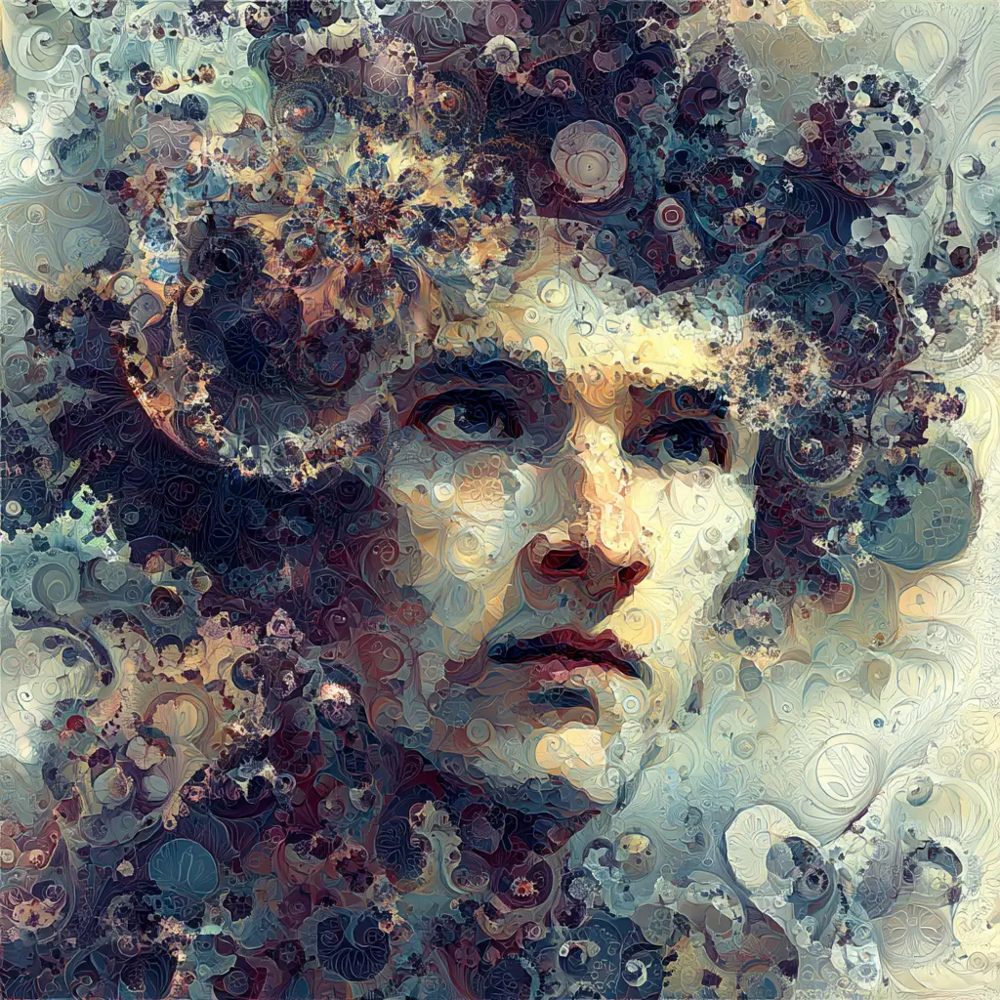

# Welcome to my GitHub profile!

  

    
  
  
  
  

My name is Simon Buré, french 🇫🇷 researcher, dev, philosopher and writer. I hold a computational biology engineering degree from INSA Lyon, a master degree in mathematics from Université Paris-Saclay and Institut Polytechnique de Paris and I'm currently undertaking a PhD at Écoles Nationale Supérieure des Mines de Paris -- PSL in applied maths (real-time, personalized monitoring of blood pressure in surgery & ICUs) and a master degree in logic and philosophy of science at Université Paris-Sorbonne.

<!-- Language breakdown computed live (byte-weighted) across all public repos -->

    
    

  

Below are open-source projects I created and dedicated myself to. Each came from a real need and fulfills a single (always), useful goal. Issues & PRs are always welcomed, so test them and tell me what breaks! If you enjoy them, find them useful, or just feeling generous, you can buy me a coffee on:

  
  

Here are some open-source repos and projects I'm really enthusiastic for, that you might like:

  
  
  
  
  
  
  
  

Stay connected and see you online!

Made with ❤️ in Paris.
